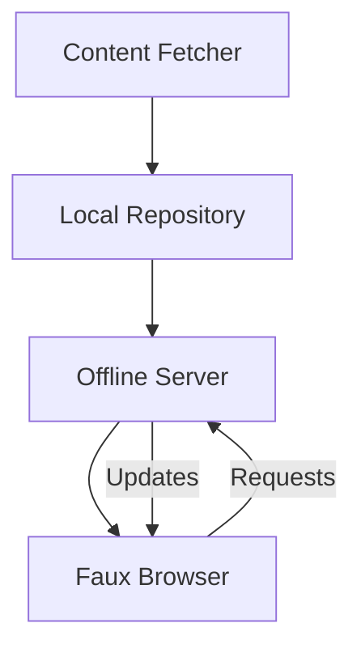

# Faux Browser System Design Basis

This document expands on the conceptual plan by outlining the key components and their responsibilities. The goal is to provide enough detail to begin prototyping.

## Components

1. **Content Fetcher (Intermediary)**
   - Runs on a server with controlled internet access.
   - Downloads whitelisted pages using a headless browser or scraper.
   - Sanitizes HTML by removing scripts, forms, and external links.
   - Stores content in the local repository with timestamps.
   - Generates a manifest that maps URLs to cached files and indicates freshness.

2. **Local Repository**
   - Directory tree containing sanitized HTML, images, and media assets.
   - Includes the manifest produced by the fetcher.
   - Versioned so that old snapshots can be rolled back if necessary.

3. **Offline Content Server**
   - Lightweight HTTP server that serves files from the local repository.
   - Provides an API to query the manifest and request pages.
   - Injects AI-generated placeholders when content is missing.
   - The prototype `offline_server.py` demonstrates this component.

4. **Faux Browser Client**
   - Desktop or mobile application using WebView/Electron.
   - Locks network requests to the offline server only.
   - Presents a minimal UI (address bar, history, back/forward).

5. **User Management**
   - Profiles define accessible domains and time limits.
   - Offline server reads the selected profile at startup and stops serving
     requests once the time limit is reached.
   - Activity logs stored locally and optionally synced to a monitoring system.
   - Parental or administrative controls adjust allowed sites.

6. **AI Assistance**
   - Local language model fills gaps in scraped pages.
   - Summarizes or explains external links that cannot be fetched.
   - Can generate child-friendly or simplified versions of text.

## Data Flow

1. The fetcher runs on a schedule, populating the repository.
2. The offline server serves pages from the repository.
3. The faux browser requests pages via the offline server only.
4. AI helpers step in when pages are stale or incomplete.

## Prototype Plan

1. **Build a CLI fetcher** that downloads a handful of pages and produces the manifest.
2. **Write a small Flask or Node server** that serves the repository over HTTP.
3. **Create an Electron shell** that locks all requests to `http://localhost:PORT` (done).
4. **Implement basic profiles** with a JSON configuration listing allowed domains.

By following this design basis, the project can evolve from a conceptual idea to a working prototype while maintaining a strict separation from the real Internet.

## Security Considerations

- **Isolated Networking**: the offline server should be on a private subnet with no direct outbound access. Only the fetcher machine can connect to the real Internet.
- **Content Sanitization**: remove JavaScript that tries to fetch external resources. Filter forms or URLs that may leak data.
- **Update Auditing**: the fetcher logs every download along with checksums. Manual review ensures no unexpected domains were contacted.

## Offline-First Rendering

A service worker can intercept all requests from the faux browser and serve files from the repository. If a file is missing, the service worker falls back to an AI-generated placeholder. This approach mirrors common progressive web app strategies for offline capability.

## Update Process

1. Fetcher downloads new snapshots on a schedule (daily or weekly).
2. Updates replace old versions atomically so that the browser never sees a partially written state.
3. The manifest includes hashes so the browser can verify integrity before displaying pages.
4. The offline server can check file hashes against the manifest when requested.

